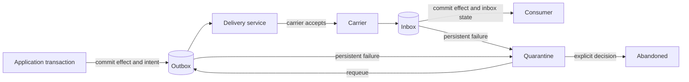
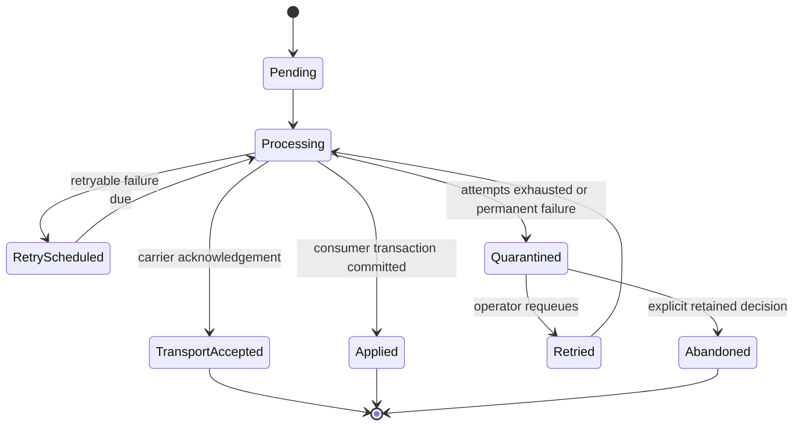

# Reliable messaging

ViciOne.ServiceBus uses one reliability model for durable send, transactional outgoing messages,
duplicate-safe consumption, delayed delivery, retry, and quarantine. The application database owns
the durable records; the broker carries messages but does not own application reliability state.

## Data flow



There is one application-owned store, one delivery service per bus, one quarantine operations API,
and one explicit scheduler choice. A scheduled message is an outbox record with `DueAt`; a recurring
schedule creates due outbox records from the same store.

## State model



Outbox and inbox persistence use the operational states `Pending`, `Processing`,
`RetryScheduled`, `Quarantined`, `Retried`, and `Abandoned`. `TransportAccepted` and `Applied` are
acknowledgement levels: the former means the configured carrier accepted the message, while the
latter means the consumer transaction committed. Neither is reported before its boundary is true.

## Configure a store

```csharp
services.AddPooledDbContextFactory<AppDbContext>(options => options.UseSqlite(connectionString));

services.AddViciOneServiceBus(bus =>
{
    bus.Limits(MessageLimits.Conservative);
    bus.AddConsumer<SubmitOrderConsumer>();
    bus.UsingInMemory((context, transport) => transport.ConfigureEndpoints(context));
    bus.UseReliableMessaging(reliable =>
    {
        reliable.UseEntityFramework<AppDbContext>();
        reliable.Store(new ReliableStoreLimits
        {
            MaximumStoredCount = 10_000,
            MaximumStoredBytes = 16 * 1024 * 1024,
        });
        reliable.Delivery(delivery =>
        {
            delivery.MaximumConcurrentDeliveries = 8;
            delivery.MaximumAttempts = 10;
            delivery.InitialRetryDelay = TimeSpan.FromSeconds(1);
            delivery.MaximumRetryDelay = TimeSpan.FromMinutes(1);
            delivery.PollInterval = TimeSpan.FromMilliseconds(250);
        });
        reliable.Retention(TimeSpan.FromDays(7));
        reliable.AddMessageContract<SubmitOrder>("orders.submit");
    });
});
```

`UseInMemoryStore()` is available for deterministic tests and process-local hosts. It provides the
same store contracts and inbox behavior but does not survive process termination.

The selected `DbContext` must call `modelBuilder.AddViciOneReliableMessaging()` and be registered
through `IDbContextFactory<TContext>`. Apply the selected database schema before starting writers;
see [migrations/README.md](migrations/README.md).

## Outbox and durable send

Within an application unit of work, outgoing messages join the same database transaction through
the scoped bus or `context.Outgoing`. The delivery service can observe the intent only after commit.

`IDurableSender<TBus>.SendAsync` admits an intent through its own small transaction when the caller
does not have an application transaction. `DurableSendReceipt` reports the durable commit; later
carrier acceptance is a separate observable outcome.

RabbitMQ acceptance requires a persistent, mandatory publish and a publisher confirmation. The
in-memory adapter removes its retained record only after consumer completion. Other transports fail
during startup when combined with reliable messaging until their provider supplies an equally strong
acceptance contract. The current matrix is [provider-capabilities.json](provider-capabilities.json).

## Inbox

The inbox key is `(MessageId, ConsumerId)`. Acquisition is fenced by a lease. A duplicate whose
effect already committed does not execute again. A retryable consumer failure becomes a
`RetryScheduled` inbox record with a due time; exhausting the configured attempts moves it to
quarantine. Consumer effects, outgoing intents, and successful inbox completion commit together
when the persistence provider supports an application transaction.

## Scheduling

With a reliable store, `IMessageScheduler` writes an outbox record with `DueAt`. Quartz and
transport scheduling are explicit adapters selected inside `UseReliableMessaging`; there is no
implicit fallback. A bus with scheduling calls but without a store or selected adapter fails during
startup.

## Operations

`IReliableMessagingOperations<TBus>` provides bounded outbox and inbox quarantine pages plus typed
`RequeueAsync`, `DiscardAsync`, and `AbandonAsync` operations. Requeue makes a record due again.
Discard removes a quarantined record. Abandon is an explicit retained terminal state with a log and
metric; it is the only operation that acknowledges deliberate non-delivery without erasing the
record.

The application owns authorization, approval, audit integration, and operator user interfaces.

## Health and telemetry

Register `AddViciOneReliableMessagingHealthCheck<TBus>()` and export the `ViciOne.ServiceBus` meter
and activity source. Health and telemetry never alter delivery behavior, and observer failures are
contained. Signal names and cardinality rules are listed in [observability.md](observability.md).
