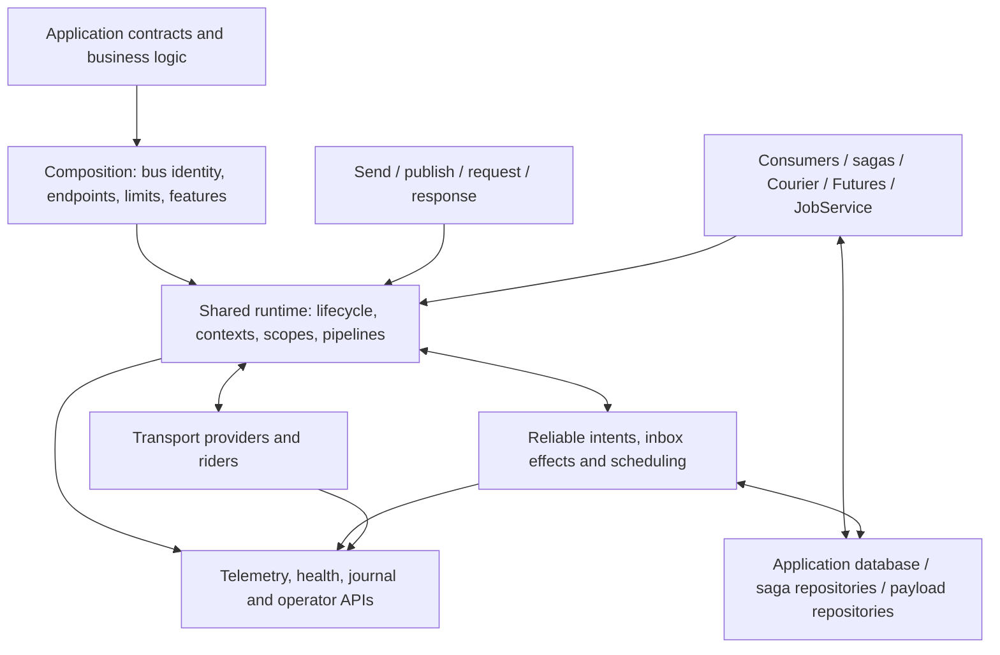

# The whole ServiceBus system

ViciOne.ServiceBus provides a common way for .NET applications to communicate through typed messages and to coordinate work over those messages. It combines a messaging runtime, transport integrations, consumer execution, reliability mechanisms and optional workflow models. It is a library platform hosted by applications; it is not itself one central broker process.

To understand the system, distinguish three questions: **how does information move, how does work execute, and which state survives failure?** Different components answer each question. Their cooperation is the system; their boundaries explain its guarantees.

## What an application delegates to ServiceBus

An application defines contracts, consumers and business decisions. ServiceBus supplies endpoint resolution, message envelopes, dispatch, consumer activation and configurable pipelines. Providers connect those mechanisms to brokers or databases. Optional capabilities add particular forms of process coordination.

For an order system, applications might send a command to fulfillment, publish an event to billing and analytics, request a price, remember a multi-step process as a saga, execute a compensatable route through Courier and run a capacity-controlled export as a job. These are different interaction models. None is the universal path through which every feature must be understood.

The repository originates from a pinned MassTransit fork, but current public APIs and reliability composition have been modified. Historical familiarity helps with concepts; current source determines behavior.

## The system map

The diagram expresses responsibilities, not every assembly dependency. For the package graph, see [Packages and ownership](packages-and-ownership.md).

## Communication models

**Send** names a destination for work. A queue can have competing receiver instances; they share that queue's deliveries. **Publish** expresses a message type to its configured subscriptions. Independent subscriber queues receive independent copies; two instances sharing one queue are not two independent subscribers.

**Request/response** adds a request identity, response destination and client-side response wait. The waiting client is not a distributed transaction coordinator. A timeout says that its deadline passed without the expected completion, not that the receiving application did nothing.

**Scheduling** arranges later eligibility or provider dispatch. A due time, cancellation token and eventual consumer result belong to separate stages.

**Mediator** dispatches directly in the same process through receive pipelines. **InMemory** supplies an in-process transport fabric with queues and exchange-like routing. Both avoid an external broker; they are distinct implementations and neither supplies persistence merely by existing.

Read [Messaging model](../learn/messaging-model.md) before choosing an API, then [Message lifecycle](message-lifecycle.md) for runtime mechanics.

## Shared execution infrastructure

A configured bus owns its transport and receive endpoints. Registration discovers consumers and optional component kinds; endpoint configuration builds the corresponding pipelines and topology. Hosting starts and stops that runtime.

A delivery becomes a receive context, then a typed consume context. The context carries message identity, correlation, headers, cancellation and outgoing operations. Dependency injection creates or reuses the relevant consumer scope. Middleware wraps execution to apply policies.

Consumer code performs business work. The runtime awaits its task and tracked consume work, then providers settle the carrier delivery. The exact completion meaning depends on the active endpoint policy: direct dispatch, local capture and persisted capture are different outcomes.

This shared infrastructure lets sagas, activities and other component kinds cooperate with ordinary messaging without making their state models identical.

## Long-lived coordination models

| Model | Where coordination lives | What it contributes |
|---|---|---|
| Ordinary consumer | One invocation plus application-owned business state | Handles one message |
| Saga/state machine | Correlated instance in a selected repository | Remembers progress across messages and enforces transitions |
| Courier | Routing-slip message, itinerary and activity/compensation history | Advances a route and invokes business compensation |
| Future | Saga-backed command/result state and subscriptions | Collects asynchronous outcomes and serves a terminal result or fault |
| JobService | Cooperating Job, JobAttempt and JobType sagas | Coordinates execution, retries, liveness and distributed capacity |

A saga is not just a consumer with more methods: correlation and repository ownership determine which process instance may change. Courier compensation is not database rollback: it invokes application-defined counter-actions. A Future is not a local `Task`: its outcome can be remembered by its repository. A job is not just a delayed message: it has execution attempts and capacity coordination.

These distinctions determine which model fits a business problem. Each has its own chapter under [Sagas](../workflows/sagas.md), [Courier](../workflows/courier.md), [Futures](../workflows/futures.md) and [Jobs](../workflows/jobs.md).

## Reliability and state ownership

The intended unified reliable-messaging model stores outgoing intents, inbox state and one-time due intents in application-owned persistence. A transactional outbox places business changes and outgoing intent in the same DbContext commit. A delivery worker dispatches committed intent later. An inbox binds processing identity to successful effects in the supported transaction.

The broker owns carrier delivery. It does not commit the application's business database. Conversely, a committed outbox row does not prove broker acceptance or consumer completion.

| State | Owner | Relevant boundary |
|---|---|---|
| Business rows | Receiving or producing application | Its transaction commit |
| Outgoing reliable intent | Selected reliable store | Admission or transactional commit |
| Inbox processing identity | Selected inbox integration | Effect and terminal state commit |
| Saga/future/job state | Selected saga repository | Repository concurrency and transaction rules |
| Carrier message | Selected transport/broker | Provider acknowledgment and settlement |
| External payload blob | MessageData repository | Blob creation, accessibility and lifetime |
| Diagnostic journal entry | Selected journal store | Policy projection and bounded append |

A process-local buffer defers work but does not create durable state. An external side effect, such as charging a payment provider, does not join a database transaction merely because the consumer uses an inbox. Business idempotency remains necessary at such boundaries.

## Providers are capability boundaries

Providers reuse the runtime but map to different infrastructure. RabbitMQ uses exchange/queue topology and acknowledgments; Azure Service Bus has queue/topic/subscription and lock semantics; SQS and SNS use visibility and topic delivery; ActiveMQ has its protocol and destination semantics; SQL transport provides database-backed carrier entities.

Event Hubs is a rider with stream partitions, consumer groups and checkpoints, not a interchangeable queue-based request transport. SignalR scale-out uses bus messages to reach node-local connections and subscriptions.

Persistence packages likewise have distinct roles. EF reliable storage, EF/DynamoDB/Azure Table saga repositories and S3/Azure Blob MessageData repositories cannot be substituted merely because all “store data.”

Durable dispatcher support is narrower than ordinary transport support. Current reliable dispatch supports RabbitMQ's explicit broker-acceptance contract and InMemory's process-local consumer-completion contract. Other ordinary transports do not thereby support the same durable sender.

See [Transports](../integrations/transports.md), [Streaming and SignalR](../integrations/streaming-and-signalr.md) and [Persistence](../integrations/persistence-and-message-data.md).

## Failure handling is layered

A pipeline retry re-invokes downstream work. Delayed redelivery arranges another delivery. Reliable outgoing retries persist dispatch failures and due times. Inbox processing persists receiver decisions. Broker locks and settlement still belong to providers.

These layers are related, but stacking them indiscriminately can repeat business work or prolong held resources. Permanent failure, delivery cancellation and a consumer unexpectedly canceling its own work also need different interpretation.

Quarantine retains a failure requiring an operator decision. An error queue carries a failed transport message. A fault message tells a requester or subscriber about failure. A journal entry records selected diagnostics. Those are separate artifacts.

## Observability and engineering

Metrics and traces describe operations; health describes runtime/store conditions. Journaling projects selected observations under an explicit policy and finite limits. Operational APIs query or change retained reliability state. Applications own authorization and operator workflows.

Testing harnesses observe actual messaging pipelines with selected transport configuration. Provider integration profiles establish infrastructure behavior; compile-only samples establish API shapes. StateMachineVisualizer and analyzers help developers inspect workflows and detect coding mistakes. None replaces a runtime durability proof.

## Current architecture discrepancies

The source review found four issues relevant to this conceptual model:

1. A separate public EF inbox/outbox model remains alongside unified reliable messaging, despite the stated single-model concept.
2. Reliable-store recurring scheduling is described, but its record is only mapped and has no connected runtime implementation.
3. The required unified retention duration is validated and frozen, but has no runtime cleanup consumer.
4. Advertised shared storage bounds account for outgoing intents without bounding retained inbox state.

They are detailed in [Implementation gaps](../reference/implementation-gaps.md). This wiki explains current code and identifies such discrepancies; it does not approve them or turn declared intentions into implemented guarantees.

## How the chapters fit together

Begin with this system map and [Messaging model](../learn/messaging-model.md). The [first application](../learn/first-application.md) then makes the basic runtime observable. Configuration and messaging chapters explain the common infrastructure; reliability chapters explain persisted boundaries; workflow chapters explain distinct coordination models; provider chapters explain infrastructure differences; operations and engineering chapters explain deployment, diagnosis and extension.

You can follow a message for one concrete scenario after understanding these relationships. One scenario illustrates the system; it does not define every part of it.
