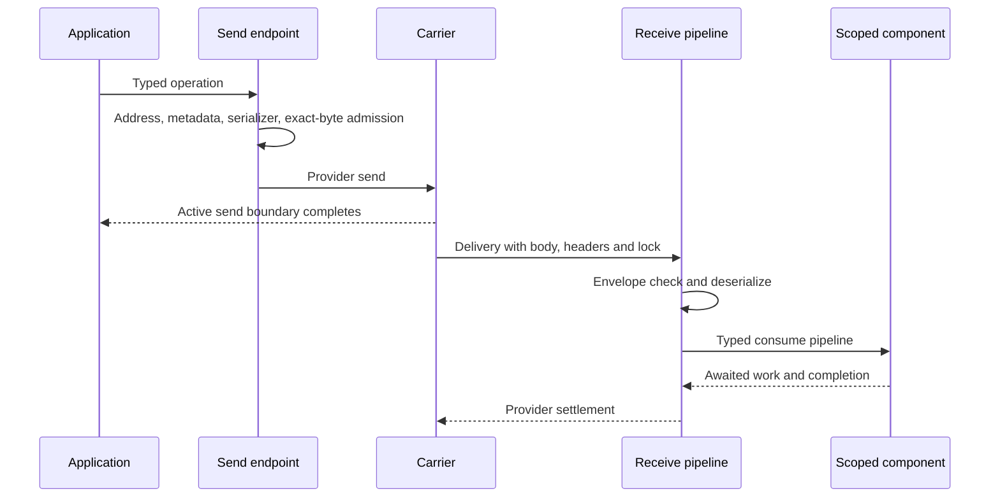

# A message through the runtime

The shared runtime turns an application operation into a transport delivery and a typed consumer invocation. This chapter follows that path after the [whole-system model](conceptual-model.md): the same infrastructure is reused by several interaction and workflow models, but persistence and completion boundaries vary by configuration.

## From an object to a delivery

A send endpoint wraps a provider transport. It supplies destination and source addresses and the serialization registry, then applies the send pipe to the transport-created send context. The context combines the typed object with metadata. Publish chooses a message-type destination rather than an explicit queue; requests additionally supply response metadata.

The serializer produces an envelope containing the body, supported contract identifiers, headers and addressing. Payload admission attaches before serialization at the provider boundary and validates the actual serialized body and envelope. It verifies that the admitted bytes and metadata belong to this bus and operation. An approximate object size is not sufficient.

The carrier owns the next boundary. Its send task reports the active transport operation; it is not an acknowledgment of arbitrary receiver business work. A lost connection or timed-out operation can leave acceptance uncertain.

## Receiving and typed dispatch

The transport presents a receive context containing encoded body, content type, headers, input address and cancellation. Providers also attach their lock and settlement capabilities.

`DeserializeFilter` checks the envelope size, chooses a deserializer by content type and produces a consume context. The serialized envelope may declare several compatible message contracts. Typed dispatch selects the matching consume pipes; it does not use the consumer's class name as the wire type.

The receive pipe installs dead-letter handling and rescue around deserialization. A delivery with no matching consumption and a delivery that fails processing have different paths. Default error handling generates a fault and moves through the error transport; default dead-letter handling uses its own transport. Actual destination naming and settlement remain provider-specific.

## Scope, component activation and awaited work

Consumer factories acquire a scope, resolve the consumer and invoke its pipeline. `ScopeConsumerFactory` awaits the operation and releases the owned scope afterward, preserving an operation failure through lifetime cleanup.

A consume context exposes the message, correlation and request information, headers, cancellation, `Outgoing`, response methods and `ConsumeCompleted`. Outgoing endpoints can propagate receive metadata. Scoped dependencies therefore work within the delivery's context rather than an unrelated global bus.

The consumer filter awaits factory execution and reports consumed or faulted outcomes. The deserializer stage awaits typed dispatch, remaining receive stages and `ConsumeCompleted`. Fire-and-forget application work escapes this ownership chain: returning from `ConsumeAsync` does not make a detached task part of the delivery.

Sagas use repository-backed consume contexts, and Courier uses activity contexts. They participate in pipelines, but repository commits and routing-slip result evaluation add their own boundaries.

## Where retries wrap execution

Retry middleware surrounds a downstream pipe. Its position determines what repeats: consumer invocation, scope acquisition or a larger operation. It may wait with the current delivery still active. Delayed redelivery instead arranges another delivery through scheduling.

Reliable inbox integration adds persisted processing identity and retry decisions. In its automatic endpoint configuration, retry observation defers intermediate fault publication while the inbox determines retained retry/quarantine state. That is different from blindly adding a second application retry budget.

Unexpected consumer cancellation is classified separately from cancellation of the delivery token. During host shutdown, cancellation propagates through owned work and provider settlement. See [Failures and retries](../reliability/failures-and-retries.md).

## Outgoing work can be intercepted

The active outgoing endpoint policy changes what an awaited call means:

| Policy | Immediate outcome | Later work |
|---|---|---|
| Direct endpoint | Transport operation | Receiver processing |
| Buffered bus | In-memory enqueue | Explicit flush, then transport |
| Volatile consume outbox | Capture in the delivery scope | Release after successful processing |
| EF transactional outbox | Staged intent in DbContext | Save/outer transaction commit, then delivery worker |
| Typed durable sender | Store admission | Dispatcher acceptance and optional completion |

A transactional inbox can combine receiver business state, outgoing intents and consumed identity in one provider transaction. The carrier acknowledgment still occurs afterward. If the process fails between commit and carrier settlement, a repeated delivery must be recognized by the inbox.

The public EF models currently differ; [Implementation gaps](../reference/implementation-gaps.md) records that architectural inconsistency.

## Settlement, readiness and resource ownership

A provider settles a completed delivery through its native mechanism: RabbitMQ acknowledgment, Azure settlement, SQS deletion/visibility or SQL unlock/delete are not interchangeable protocols. Lock loss can invalidate a later settlement even when application work already ran.

The runtime owns host and endpoint lifecycle, the depot groups bus instances, and a hosted service drives startup and shutdown. Endpoint readiness must precede work that depends on that endpoint. Resource caches and supervisors reuse connections/contexts; their lifetime belongs to the runtime, not to each business consumer.

Metrics and traces observe these stages. A diagnostic journal records selected projections. Neither determines whether business work commits.

## Investigating one message

Trace the identities and boundaries in order: selected bus and endpoint; serialized contract and content type; receive input address; matching component; awaited business operation; outgoing capture or transport operation; database commit; carrier settlement. A missing event can be a topology issue, a contract mismatch, a captured uncommitted intent or a consumer failure. The same symptom does not imply the same cause.

Source entrypoints: [SendEndpoint](../../src/ViciOne.ServiceBus/Transports/Sending/SendEndpoint.cs), [payload boundary](../../src/ViciOne.ServiceBus/Serialization/Admission/PayloadAdmissionTransportBoundary.cs), [receive configuration](../../src/ViciOne.ServiceBus/Configuration/ReceivePipeConfiguration.cs), [DeserializeFilter](../../src/ViciOne.ServiceBus/Middleware/DeserializeFilter.cs) and [consumer filter](../../src/ViciOne.ServiceBus/Middleware/ConsumerMessageFilter.cs).
