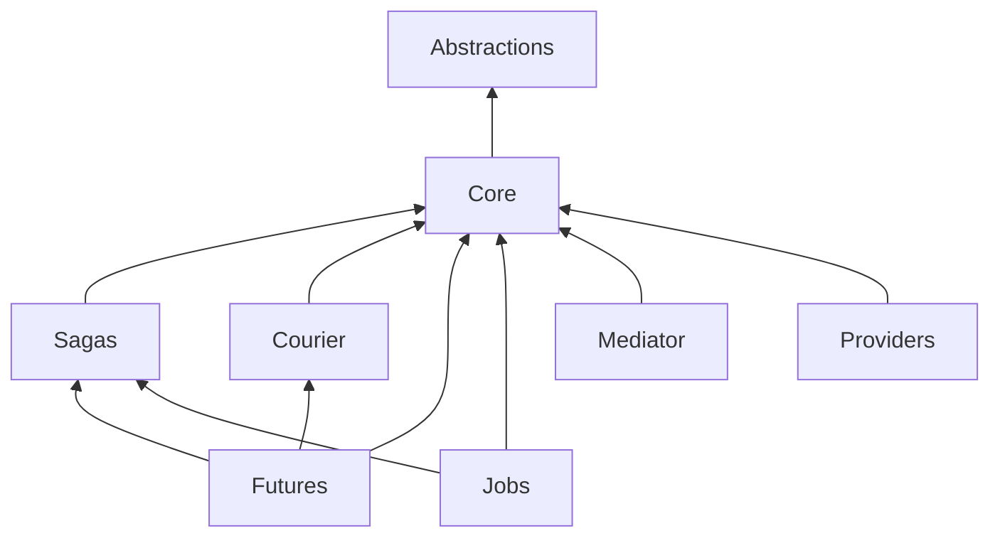

# Packages and responsibility boundaries

Packages determine which implementations an application can load. Composition determines which implementations its bus uses. Keep these decisions separate: referencing RabbitMQ makes that transport available; selecting `UsingRabbitMq` makes it the bus's carrier.

## Dependency direction

Core (`ViciOne.ServiceBus`) references Abstractions as its only direct first-party project dependency. Abstractions owns shared application and neutral extension contracts, together with neutral helpers. Core owns composition, lifecycle, ordinary consumers, clients, pipelines and InMemory transport.

An arrow means “references.” Provider-specific edges are omitted here: some providers also reference Sagas, and the EF saga integration references workflow capabilities. The graph permits basic messaging applications to select only their necessary capabilities.

## Choosing packages

| Application need | Package family | Responsibility you still own |
|---|---|---|
| Basic bus and consumers | Core plus selected transport | Contracts, endpoints, credentials and host |
| Correlated process state | Sagas plus repository integration | State shape, correlation and concurrency |
| Compensatable activity route | Courier | Activity logic, log shape and compensation |
| Durable asynchronous result | Futures | Command/result contracts and future repository |
| Managed execution and slots | JobService | Job policy, repositories and scheduling |
| Direct in-process messaging | Mediator | Scope and process lifetime |
| EF reliable outgoing/incoming state | EntityFrameworkCore | DbContext, schema, transactions and growth controls |
| EF workflow persistence | EntityFrameworkCore.Sagas | Workflow model mappings and repository policy |
| External payload blobs | AmazonS3 or Azure.Storage integration | Access, lifecycle and cleanup |
| Quartz scheduling | Quartz | Scheduler store/factory and bus-bound lifecycle |
| Binary format | MessagePack | Compatible serializer configuration |

The base EF package references Core. The separate EF Sagas package references base EF, Sagas, Futures and JobService. “We use EF” is therefore not a sufficient package-selection rule.

Azure Table supplies saga storage and journal storage; DynamoDB supplies saga storage. S3 and Azure Blob supply MessageData. These do not all implement the unified reliable-store contract. The [persistence chapter](../integrations/persistence-and-message-data.md) explains the differences.

## Public layers

Application contracts live primarily in `ViciOne.ServiceBus`. Use typed `SendAsync`, `PublishAsync`, `GetResponseAsync`, schedule operations and `ConsumeAsync`. Configuration types belong to `ViciOne.ServiceBus.Configuration`; DI extensions are discoverable from `Microsoft.Extensions.DependencyInjection`.

`Advanced` and its focused child namespaces expose deliberate framework extension contracts: middleware, serialization, topology, observers, registration and initializers. `Providers` exposes transport and persistence integration. `Operations` exposes operator actions and bounded queries. Testing packages expose harnesses and observations.

A namespace is not an assembly boundary. A shared namespace may span several capability assemblies. A public Advanced type is available to application code, but using it means accepting an extension-level contract and lifecycle responsibility.

## Consumers are extended by component kinds

The registration/runtime system accommodates different consumer kinds. Sagas and activities contribute specialized configuration, scope and pipeline behavior rather than putting every optional model into Core. JobService and Futures likewise register their own component behaviors.

This is why the package graph and runtime model should be read together: optional assemblies extend common composition and pipelines but retain ownership of their state and specialized execution semantics.

See [Whole system](conceptual-model.md) and [Middleware and extensions](../engineering/middleware-and-extensions.md).

## Provider-owned infrastructure

Transport packages own their SDK, addressing, entity topology and connection/receive/send implementation. A common application API does not erase native behavior. Request/reply requires working response addressing; scheduling requires an appropriate adapter; reliable dispatch requires an explicit acceptance implementation.

Event Hubs is a rider attached to an owning bus; SignalR adds a backplane integration that routes operations to node-local hub state. Their public presence does not make either a generic replacement for queue-based bus transport.

## Engineering dependencies

Testing references several capabilities so harnesses can observe them. Provider testing packages add infrastructure-specific setup. Those dependencies belong in an application's test projects, not in ordinary runtime package selection.

Analyzers and CodeFixes supply compiler/IDE checks, while Analyzers.Package packages that tooling. StateMachineVisualizer adds graph rendering for the saga model. Initializers adds specialized convention-driven construction, and diagnostics/benchmarks live in the engineering graph.

## Origin and current contracts

The README records a complete fork of MassTransit 8.5.10 at a fixed upstream commit, retained Apache 2.0 licensing and ViciOne modifications. The source now uses ViciOne.ServiceBus assemblies, namespaces and revised application call forms.

The inherited design explains familiar messaging concepts. Current source and the packed public API baseline determine what is actually exposed. The [implementation gaps](../reference/implementation-gaps.md) identify where the published unified concept and current implementation diverge; provenance does not resolve those differences.

Source: [Core project](../../src/ViciOne.ServiceBus/ViciOne.ServiceBus.csproj), [capability matrix](../../docs/provider-capabilities.json), [API layers](../../docs/api-surface.md), and [README](../../README.md).
