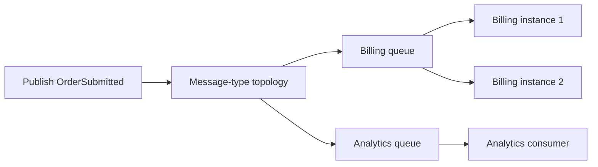

# Addresses, endpoints and topology

Topology is the connection between logical messaging intent and physical delivery entities. An address chooses a destination; endpoint configuration creates a receiving pipeline; publish topology determines which destinations receive a message type. Confusing those roles is a common cause of “the send succeeded but nothing consumed it.”

## Three names with different meanings

A message contract identifies the type of information. A consumer type identifies application behavior. An endpoint name identifies a receiving destination/pipeline. They need not have the same name or a one-to-one relationship.

Automatic configuration derives endpoint names from definitions and a formatter and groups eligible component registrations. Several components can share an endpoint. A component can also be excluded from automatic endpoint configuration and attached explicitly.

The default formatter removes suffixes such as Consumer, Saga and Activity. It can include namespaces and prefixes; KebabCase and SnakeCase formatters offer other conventions. Do not assume that `SubmitOrderConsumer` automatically produces `submit-order` under every formatter.

## Addressed send

`ISendEndpointProvider.GetSendEndpointAsync(address)` resolves an endpoint for a destination. Short `queue:` addresses are interpreted relative to the selected transport/host. Full provider addresses identify a more explicit carrier location.

A route convention can map a contract to a destination for calls without an explicit address. A route is application configuration, not a broker subscriber discovery service. Missing or ambiguous routes must be corrected at that boundary.

For a predictable example, derive the automatic queue name from the same formatter:

```csharp
var address = new Uri(
    $"queue:{DefaultEndpointNameFormatter.Instance.Consumer<SubmitOrderConsumer>()}");
ISendEndpoint endpoint =
    await sender.GetSendEndpointAsync(address, cancellationToken);
await endpoint.SendAsync(command, cancellationToken);
```

This excerpt assumes `sender`, `command` and the consumer are defined, and that the receiving bus uses the matching formatter and endpoint configuration.

## Publish and subscriptions

Publish selects message-type topology. Providers map that topology to their native entities: RabbitMQ exchanges and bindings, Azure topics/subscriptions, SQS/SNS topics and queue subscriptions, or SQL topics and queue subscriptions.



Billing and analytics have independent subscriptions. Billing instances compete on one queue. Publication is therefore neither a call to every class nor a guarantee of one durable copy per running process.

A subscriber normally must configure its consumption topology before expecting publications. Retention of messages published before a subscription exists depends on the carrier and entity configuration; the common publish API does not create universal historical replay.

## Definitions and shared endpoints

Consumer and saga definitions specialize endpoint naming and component configuration. Automatic configuration merges the registered components associated with an endpoint.

Transport QoS is endpoint-wide. The topology validator rejects consumer-owned QoS on an endpoint shared by multiple consumers, because one consumer definition cannot privately own a setting affecting all queue traffic. Conflicting endpoint declarations also fail.

Consumer execution concurrency is a different control: it limits component work. Prefetch and receive settings control carrier admission. Read [Concurrency](../messaging/concurrency-and-batching.md) before setting one value as if it controlled every stage.

## Message topology and contract evolution

Publish and consume topology may include compatible contracts declared by a message, unless excluded or explicitly configured otherwise. Excluding a base contract from topology prevents unintended subscriptions; it does not erase the contract from every serialization or reflection surface.

Changing a CLR contract name, namespace or entity naming convention can change wire identifiers or broker resources. A stable reliable contract identity protects durable catalog lookup, but does not automatically migrate every serialized message type or physical entity.

Likewise, renaming an automatically named consumer can create a new queue and leave the old queue with pending messages. Treat endpoint names as deployment-facing contracts when persistence matters.

## Temporary and reply endpoints

Request clients need a receiving path for responses. Temporary endpoints and provider-native reply mechanisms have different lifetime and durability properties. RabbitMQ direct reply-to is deliberately excluded from the strong reliable-dispatch acceptance path.

Azure automatic subscription names have an explicit resource cutover procedure in the repository. Native entity properties can become immutable after topology evaluation; declarations must agree with existing resources.

## Deployment and diagnosis

Before deploying a topology change, identify the producing contract, intended receiver queues, naming convention, entity durability and permissions. A topology declaration error is different from a missing consumer or incompatible serialized contract.

Check the resolved destination and receive input address, not only the application's message name. For publication, envelope destination may name the publishing entity while the receiver's input address names its subscribed queue.

Source: [registration grouping](../../src/ViciOne.ServiceBus/Configuration/DependencyInjection/BusRegistrationContext.cs), [default naming](../../src/ViciOne.ServiceBus/Configuration/DefaultEndpointNameFormatter.cs), [QoS ownership](../../src/ViciOne.ServiceBus/Configuration/Qos/EndpointQosTopologyValidator.cs) and [Azure cutover](../../docs/migrations/azure-automatic-subscriptions.md).
