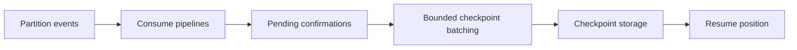

# Event Hubs streaming and SignalR scale-out

Event Hubs and SignalR integrate with ServiceBus for different purposes. Event Hubs processes streams with partition checkpoints. SignalR uses bus messages to scale out hub operations across processes. Neither should be explained as merely another ordinary queue transport.

## Event Hubs is a rider

A rider attaches specialized infrastructure to an owning bus instance. `EventHubRider` owns its configured receive endpoints, connection supervisor and shared producer provider. Bus/rider lifecycle starts endpoints and stops their owned resources together.

A producer provider resolves Event Hub producers; a consume-context wrapper propagates causal headers when producing from a received message. This is not the ordinary `IPublishEndpoint` subscription model.

Endpoint configuration identifies an Event Hub and consumer group. The group coordinates partition ownership. Separate groups maintain independent consumption progress, while receivers within a group share partition work.

## Partitions and checkpoints

A stream retains ordered positions within partitions. A checkpoint records how far consumption has progressed. It is not equivalent to deleting one queue message after each consumer invocation.

The batch checkpointer queues pending confirmations in a bounded channel. It waits for confirmations and batches checkpoint work by count/interval, advancing through confirmed positions. On restart or reassignment, events beyond the stored checkpoint can be replayed.



Business effects need to tolerate replay. A consumer task completing does not mean its partition checkpoint has already been persisted. Checkpoint lag and business failure must be diagnosed separately.

## Producer and consumer configuration

Select the rider's connection, Event Hub entities, consumer groups and checkpoint storage deliberately. Producers choose partition behavior through the provider surface; consumer groups are not interchangeable with application queue names.

Throughput tuning combines event processing concurrency, partition distribution, checkpoint batch size/interval and downstream resource capacity. Too-frequent checkpoints increase storage work; too-infrequent checkpoints increase potential replay after failure.

The common reliable dispatcher support matrix currently does not supply Event Hubs durable-send acceptance. Rider production does not inherit that guarantee from a separately configured RabbitMQ bus.

## SignalR keeps connections local

A SignalR hub lifetime manager knows this process's connections, groups, users and pending client invocations. The ServiceBus-backed manager has a node identity and local indexes; it sends bus messages so other nodes can act on their own connected clients.

`AddSignalRBackplane<THub>` registers the lifetime manager and specialized consumers for broadcast, connection, group, user, group-command, client-result and invocation-cancellation operations. Registration is scoped to the owning bus and hub type.

Configuration excerpt:

```csharp
bus.AddSignalRBackplane<NotificationsHub>();
```

It belongs in an existing bus registration with SignalR services, the selected carrier, limits and endpoints configured. It does not create a complete web host by itself.

## Backplane routing and acknowledgments

Broadcast and targeted operations become messaging operations whose consumers inspect node-local state. Remote group operations use request/response with a configured timeout. Client invocation results must route to the originating node's pending invocation.

A broker accepting a backplane message does not prove the client received or processed a hub invocation. A disconnected client and an unavailable destination node are different failure cases. Group membership and connection state are not durable global business records.

## Lifetime and isolation

Register each hub type once; configuration checks reject duplicates and invalid options. Node-local state must be cleaned up on disconnect and shutdown. Pending invocations have completion/cancellation ownership independent of carrier send completion.

Separate hub types and bus owners need matching endpoint identity and scopes. The package-only SignalR sample checks assembly/registration usability, not every deployed multi-node race.

## Choosing among these and ordinary messaging

Use a queue-based bus for competing command work and durable subscriber queues. Use Event Hubs when partitioned stream consumption and replay positions are the actual model. Use SignalR backplane integration when existing hub connections span application nodes.

An application can combine them, but each integration retains its own state, lifecycle and completion boundary. [Whole system](../architecture/conceptual-model.md) places them within the shared runtime; [Transports](transports.md) covers the carrier model.

Source: [EventHubRider](../../src/Transports/ViciOne.ServiceBus.EventHubs/EventHubIntegration/EventHubRider.cs), [checkpoint batching](../../src/Transports/ViciOne.ServiceBus.EventHubs/EventHubIntegration/Checkpoints/BatchCheckpointer.cs), [SignalR registration](../../src/Transports/ViciOne.ServiceBus.SignalR/SignalRBackplaneExtensions.cs) and [hub manager](../../src/Transports/ViciOne.ServiceBus.SignalR/Runtime/ServiceBusHubLifetimeManager.cs).
