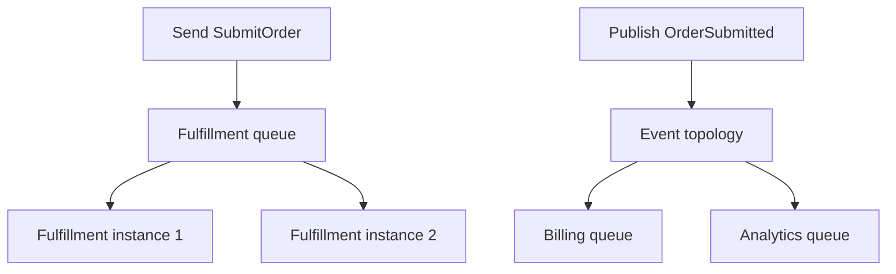

# The messaging model

Messaging separates the production of information from the execution of work. An application sends a typed contract; another component receives it through configured topology and performs business behavior. The producer and consumer can have different lifetimes, machines and failure states.

A bus is the application-hosted runtime connecting those pieces. A broker is the carrier service. A consumer is application behavior. A queue is a destination holding work for receivers. These names describe different responsibilities.

## Commands and events

A **command** asks an owner to do something: `SubmitOrder`. It normally goes to an explicit destination, because the application knows which service owns that responsibility.

An **event** states something that happened: `OrderSubmitted`. It normally goes through publish topology so independently interested services can subscribe.

These are design meanings, not different base classes enforced by the runtime. Both are reference-type message contracts. Good names and ownership keep the distinction understandable.

Publishing a command to several receivers can produce ambiguous business ownership. Sending an event to one queue is possible, but it then has the routing semantics of that explicit destination.

## Competing work versus independent subscribers

Instances sharing fulfillment compete for deliveries; they are capacity for one logical receiver. Billing and analytics receive independent subscribed copies and can succeed/fail independently.

A consumer class existing in an application does not automatically subscribe it. Registration, endpoint configuration and provider topology establish that connection.

## Messages are data contracts

A contract should carry the information needed to interpret the operation, not a reference to a producer's live object graph. The receiving application deserializes bytes into a matching contract.

Message identity distinguishes an individual message. Correlation identity associates related work. Conversation identity groups causal exchanges. A request identity matches replies. Reusing one identifier for every purpose can hide duplicates or misroute process state.

Current stable reliable contract names/major versions are catalog identities distinct from CLR deployment identity. Ordinary envelope message-type identifiers and physical entity names have their own compatibility consequences.

See [Contracts and serialization](../messaging/contracts-and-serialization.md).

## Requests add a response path

Request/response sends or publishes a request with a response address and registers a waiter for a matching request ID. The consumer responds through its context; a fault or deadline can complete the wait instead.

It is useful when the caller needs a specific result. It also couples the caller's useful lifetime to a response deadline. Long-lived business coordination belongs in persisted workflow state rather than keeping one client task waiting indefinitely.

A timeout means the response wait did not complete in time. The receiver might have committed work, and a late response may still arrive. Retrying a command request therefore needs business idempotency.

## Delivery does not equal effect

A producer can serialize successfully while the transport later fails. A carrier can accept a message while no consumer has run. A consumer can perform an external effect and then fail before settlement. A database transaction can commit before a broker receives its outgoing event.

Reliable messaging closes selected gaps with persistent intents and inbox state. It does not make every external effect exactly once.

| Observation | What it establishes |
|---|---|
| Direct send task succeeded | Active endpoint/transport operation completed |
| Outbox capture succeeded | Intent staged or captured under that policy |
| Durable admission receipt | Selected store admitted the intent |
| Carrier acknowledgment | Provider acceptance boundary reached |
| Response received | Matching response path completed |
| Business transaction committed | Its owned effects became persistent |

The application must select the observation that actually answers its business question.

## Processing context

`ConsumeContext<T>` carries the typed message and metadata together with cancellation, responses and outgoing operations. It also tracks work needed before consumption completes.

Use the context's outgoing surface when producing follow-up work belonging to that delivery. Middleware/outbox wrappers can replace its active outgoing endpoints. Injecting an unrelated singleton bus can bypass intended scope ownership.

Return/await business work. A detached task can fail after the runtime has considered the consumer complete.

## Beyond one message

Sagas remember a correlated process across messages. Courier advances and compensates an activity route. Futures collect results. JobService coordinates attempts and slots. All use messages, but they do not replace the basic meaning of send, publish and response.

Mediator uses direct local dispatch; InMemory supplies a local transport fabric. They are useful alternatives when an external broker is not the actual requirement, with different failure and persistence boundaries.

## Design from ownership

For each interaction, identify the business owner, intended receivers, failure tolerance, state owner and completion evidence. Then choose communication, reliability and workflow capabilities separately.

The [whole-system chapter](../architecture/conceptual-model.md) shows how those choices cooperate. The [first application](first-application.md) makes a basic request observable; it is one example after the conceptual model, not the definition of the whole system.
