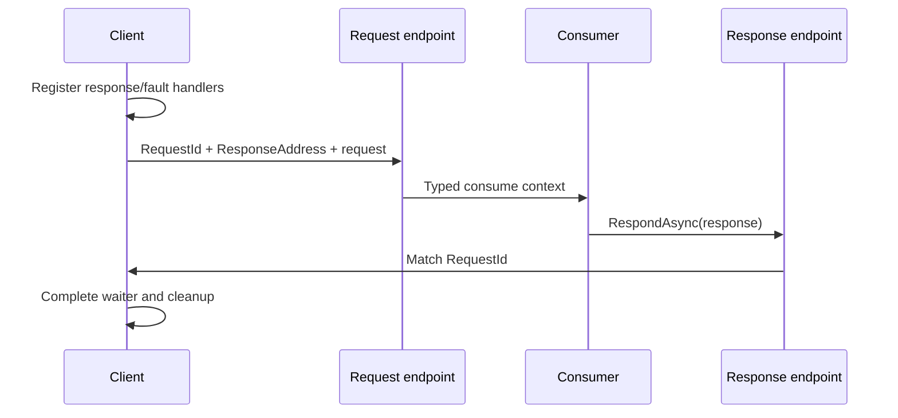

# Requests, responses and timeouts

Request/response adds a temporary result-waiting relationship to messaging. The request still crosses send, carrier and consume boundaries; the client additionally correlates a response, a fault or a deadline. It is useful for obtaining a result, but it is not a distributed transaction.

## The interaction



Handlers must be registered before the request is released for sending. Otherwise a fast responder could answer before a waiter exists. The runtime's request handle uses a registration gate and protects terminal completion from competing outcomes.

## Application API

Given a configured client:

```csharp
Response<OrderStatus> response =
    await client.GetResponseAsync<OrderStatus>(
        new GetOrder(orderId),
        cancellationToken);

OrderStatus status = response.Message;
```

This excerpt assumes the request/response contracts and an `IRequestClient<GetOrder>`. Register the client for an explicit destination when one service owns the query, or use the configured message publication path deliberately.

The receiving consumer responds through its context:

```csharp
return context.RespondAsync(
    new OrderStatus(context.Message.OrderId, "accepted"));
```

The application must determine whether “accepted” means admission, validation or a committed business effect. The runtime cannot infer that meaning.

## Correlation

The outgoing request carries a request ID, response address and accepted response contract identifiers. The response path uses request correlation; an arbitrary business ID inside the response body is not automatically the correlation header.

Correlation ID and conversation ID describe business/causal relationships but need not be the request ID. Explicit typed options can supply metadata where appropriate.

Faults use a matching typed request fault surface. A response whose type or request identity does not match the waiter cannot satisfy it merely because its payload looks similar.

## Deadline, TTL and cancellation

A client timeout bounds response waiting. A transport TTL limits delivery eligibility. A caller cancellation token controls cooperative send/wait lifetime. They are distinct.

```csharp
var options = new RequestOptions
{
    Deadline = DateTimeOffset.UtcNow.AddSeconds(10),
    CorrelationId = orderId
};

Response<OrderStatus> response =
    await client.GetResponseAsync<OrderStatus>(
        new GetOrder(orderId), options, cancellationToken);
```

This illustrates explicit application options. The absolute deadline is checked by request machinery; TTL can be configured independently. An advanced request timeout overload exists for deliberate extension use, but the preferred application form uses typed options.

The request handle uses a `TimeProvider` timer and checks expired absolute deadlines before sending. A timeout or cancellation completes pending signals, disconnects response/fault handlers and requests send cancellation. Cleanup observes the send rather than pretending it vanished.

## Races and uncertain effects

A fast response, send failure, request fault and timer can compete. The handle records terminal state so the outward result follows the actual winning/required boundary. Receiving a reply while its send task remains incomplete also requires preserving send failure rather than manufacturing a success.

A timed-out caller cannot conclude that the command was never processed. The receiver can commit and answer after the deadline, or answer while the reply carrier fails. Retrying an effectful request therefore needs an idempotency key or a separately queryable business operation.

## Request fault versus business rejection

A consumer exception can become `RequestFaultException` with typed fault details. An expected business rejection is often better represented by an explicit response contract, so callers can distinguish a valid negative outcome from infrastructure/execution failure.

Multiple accepted response types express alternative outcomes. Register them before releasing the request send gate. Do not add a response handler after sending has already been released.

## Outbox and response timing

The response operation follows its active endpoint policy. A volatile outbox can capture it until successful consumption; a transactional EF outbox can stage it until commit. The client deadline can expire while the response is still captured.

Do not wait inside a consumer for an outgoing request whose dispatch depends on that consumer completing the same outbox scope. Model a long-lived interaction through a saga/Future rather than forcing a local waiter to survive an entire business process.

## Ordinary clients versus saga requests

An ordinary request handle lives in the requesting process. A saga request records request identity in process state and uses scheduled timeout messages. Scheduler cancellation capability therefore matters for a saga timeout but is not the same mechanism as a client timer.

Read [Sagas](../workflows/sagas.md) and [Scheduling](../workflows/scheduling.md) before applying ordinary client assumptions to long-lived workflows.

Source: [request handle](../../src/ViciOne.ServiceBus/Clients/Requests/ClientRequestHandle.cs), [response registration](../../src/ViciOne.ServiceBus/Clients/Requests/ClientRequestHandle.Responses.cs), [terminal cleanup](../../src/ViciOne.ServiceBus/Clients/Requests/ClientRequestHandle.Completion.cs) and [application options](../../src/ViciOne.ServiceBus.Abstractions/RequestOptions.cs).
