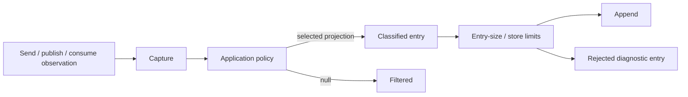

# The diagnostic message journal

The message journal records selected diagnostic projections of messaging observations. It answers “what did this configured observer capture?” It is not an outbox, inbox, business audit ledger or proof that every operation was recorded.

## Capture, policy, projection and storage



Observers report operations and outcomes to a writer. The writer constructs a capture, invokes the policy and creates an entry from its projection. The policy can return null to filter the observation entirely.

This separates information available during capture from information permitted in storage. A projection can include metadata only, a sanitized body or another deliberate subset.

## Explicit composition

The repository journal journey selects EF storage, finite entry/count/retention settings, a metadata-only policy and continue-flow options.

Configuration excerpt:

```csharp
bus.UseMessageJournal(journal => journal
    .UseEntityFramework<JournalDbContext>(
        journalDatabaseOptions,
        "MessageJournal",
        new MessageJournalStoreLimits(
            maximumEntryBytes: 64 * 1024,
            maximumEntries: 10_000,
            retentionPeriod: TimeSpan.FromDays(7)))
    .Policy(policy)
    .Options(MessageJournalOptions.ContinueMessageFlow(
        TimeSpan.FromSeconds(2), TimeProvider.System)));
```

This requires application-owned EF options/context/schema, an `IMessageJournalPolicy`, normal bus limits and transport. It is not a complete host.

Journal retention is its own provider contract. It does not make the currently unused unified reliability retention duration enforce inbox cleanup.

## Projection policy

A metadata-only policy can retain operation/outcome and content/message-type information without persisting payloads:

```csharp
public ValueTask<MessageJournalProjection?> ProjectAsync(
    MessageJournalCapture capture, CancellationToken token)
{
    token.ThrowIfCancellationRequested();
    return ValueTask.FromResult<MessageJournalProjection?>(
        new MessageJournalProjection(
            MessageJournalDataClassification.Internal,
            capture.ContentType,
            capture.MessageTypes,
            metadata: new Dictionary<string, string>
            {
                ["operation"] = capture.Operation.ToString(),
                ["outcome"] = capture.Outcome.ToString()
            }));
}
```

This is the method body of a policy implementation; use the journal namespace and implement its interface. Real classification and sanitization belong to the application.

Classification records a decision; it does not itself encrypt every entry or establish access control. Store authorization and retention must match the data actually retained.

## Failure behavior

The writer links operation cancellation with a bounded write timeout. It tracks phases such as capture, policy and store, and emits stored/filtered/failed diagnostic outcomes.

Oversized projections are rejected rather than appended. Timeout, cancellation, policy failure and storage failure are contained by the writer's continue-message-flow behavior. Therefore a successful business operation can lack a journal entry.

The timeout token requires cooperative implementations. A custom store/policy that ignores cancellation can still delay the awaited callback; a configured timeout is not a forced termination of arbitrary code.

## Outcome interpretation

An observed send outcome follows the active outgoing policy. With an outbox it can describe capture/enqueue separately from later dispatch. A consumed observation belongs to runtime processing; the journal is not the authoritative database transaction record.

Use message correlation and the relevant state store to diagnose business completion. A journal projection may intentionally omit identifiers or body fields, so absence from a query can also reflect policy choices.

## Store choices and boundedness

EF and Azure Table integrations provide journal storage under their own limits and deployment settings. Maximum entry bytes bounds an individual projection; maximum entries and retention control journal storage according to the selected implementation.

Externalizing a payload through MessageData does not necessarily remove it from a careless capture policy. Decide what the journal may store independently of the wire contract.

## Operational use

Journal entries help answer selected send/publish/consume questions and correlate failures when the policy permits it. Metrics identify trends; traces describe causal paths; the journal offers retained projections. These complement each other.

The inherited message-audit compatibility surface was removed. The journal is intentionally policy-controlled and incompatible with assuming automatic capture of all historical audit data. It is also not a second mandatory Suite audit system.

Source: [writer](../../src/ViciOne.ServiceBus/MessageJournal/MessageJournalWriter.cs), [policy journey](../../samples/DeveloperJourneys/Journey15MessageJournal.cs) and [removed audit capability](../../docs/changelog/removed-capabilities.md).
