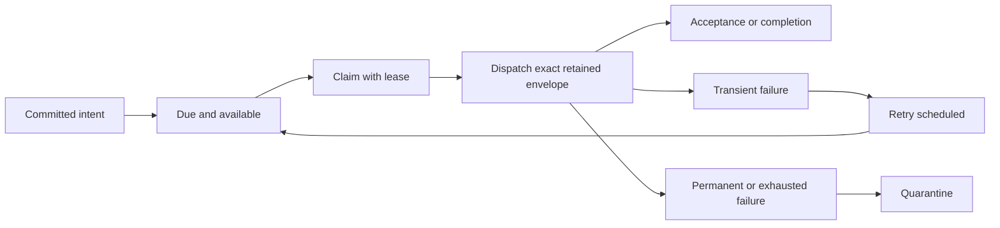

# Durable delivery, retries and quarantine

Durable delivery begins when an outgoing intent is admitted to a store. It ends at the completion boundary selected by the dispatcher. Between those points, the reliable delivery service owns claiming, leases, retries and quarantine. This differs from a consumer's local middleware retry and from ordinary broker redelivery.

## Admission is a promise to retain work

Admission stores the serialized outgoing content and its required metadata. An idempotency key identifies an intent; it is not a claim that all downstream effects occur once. The caller must distinguish capture inside an uncommitted transaction from committed store admission.

Stored due time can defer eligibility. Outgoing count and retained-content bounds can reject further admission. The current bound applies to the outgoing ledger; it does not bound every inbox table, as [SB-ARCH-04](../reference/implementation-gaps.md) explains.

## The worker's state machine

The worker claims eligible work up to its execution capacity rather than claiming a large idle batch. Leases establish temporary delivery ownership. Persistence updates must still validate ownership: an expired or superseded worker cannot safely treat its own result as current.

A dispatch can succeed while recording success fails. In that case the intent may be replayed. This is a fundamental duplicate boundary; the inbox and business idempotency strategy must address it.

## What counts as completion

A dispatcher reports an explicit completion kind. RabbitMQ reliable delivery uses transport acceptance: persistent mandatory delivery, broker acknowledgment and the supported destination-equivalence checks establish its carrier boundary. They do not wait for the remote consumer's database commit.

InMemory reliable delivery can wait for consumer completion and uses completion capabilities with generation fencing. This is a local runtime guarantee and does not make an in-memory store survive process loss.

Reliable dispatch is currently supported for selected carriers, principally RabbitMQ and InMemory. Ordinary transport send/publish support does not imply this stronger integration. Consult [transport selection](../integrations/transports.md) before choosing a persistence/carrier combination.

## Failure classification and retry

Transient carrier failures are rescheduled using the configured bounded retry policy, with backoff and jitter. Permanent or unclassified failures can enter quarantine; exhausted attempts also require an operator decision. The retained intent remains separate from the original caller's already completed admission operation.

Quarantine preserves failed work for investigation. It is not the same as a broker error queue holding a failed received envelope. One concerns outgoing delivery ownership; the other concerns receive processing. Diagnose the correct side before replaying anything.

## Operator decisions

`IReliableMessagingOperations<TBus>` provides bounded queries and typed decisions for retained state. Requeue attempts delivery again after the underlying cause is corrected. Discard removes retained work according to the operation contract. Abandon is a terminal retained inbox decision; it is not an outgoing abandonment operation.

Inspect each typed disposition rather than assuming an operation applied. A record can change state between an operator's query and command. Repeating an inapplicable command must not be interpreted as another successful transition.

Before requeueing, establish whether the previous attempt could already have reached the carrier. Replays can duplicate delivery. The [inbox](inbox-and-idempotency.md) explains the consumer-side boundary; [transactions](transactions-and-outbox.md) explains how intents become committed.

## Source grounding

The [delivery service](../../src/ViciOne.ServiceBus/Providers/Persistence/ReliableMessaging/ReliableMessagingDeliveryService.cs) and its delivery/failure-handling parts define the coordinator. [Provider capabilities](../../docs/provider-capabilities.json) define supported combinations.
