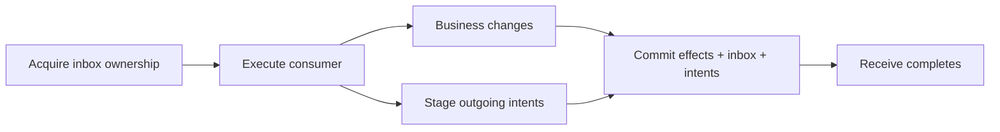

# The inbox and duplicate-safe effects

An inbox protects a consumer's committed effects against repeated delivery of the same message. It does not prevent the broker from delivering twice. It records whether a particular consumer has already processed that message, and coordinates exclusive attempts while processing is in progress.

## Identity and ownership

The reliable inbox key combines message identity and consumer identity. Bus persistence identity scopes the stored state to its owning bus. Two different consumers of an event need distinct inbox identities because each has its own effects to commit.

These identities must remain stable across replicas and deployments. Changing a consumer identity can make previously processed work look new; changing a message ID on replay can bypass duplicate detection. A business idempotency key may also be required when two different messages represent the same business instruction.

Acquisition returns a disposition rather than blindly allowing execution. Terminal consumed, quarantined or abandoned state prevents ordinary execution. An active lease belongs to an attempt; fencing prevents a superseded attempt from committing as the current owner.

## The transactional EF boundary

The EF reliable receive integration creates the inbox context and runs consumer work within its transaction boundary. Its successful path records consumption together with business changes and captured outgoing intents in the selected DbContext transaction.

A repeated broker delivery after that commit can be skipped through terminal inbox state. A failure before commit rolls back the transaction and aborts that attempt's captured outgoing work. Failure handling can persist the failure disposition separately, without pretending the failed business transaction committed.

This atomic boundary requires the effects to participate in the selected DbContext transaction. Merely resolving another database connection in the DI scope does not enlist it. A HTTP payment call is not rolled back when the inbox transaction rolls back.

## External effects need their own strategy

Suppose an invoice consumer updates its database, charges a card and emits an event. The inbox/outbox transaction can cover the database update and captured event. The payment service must accept an idempotency key or support reconciliation because charging can succeed before local commit fails.

A safer business protocol can separate requested payment from confirmed payment and model their interaction as a saga. That makes uncertainty explicit rather than trying to turn a local transaction into a distributed rollback.

## Retained state matters

Terminal inbox records protect later duplicate deliveries. Removing them trades storage for a shorter duplicate-detection horizon. An old broker replay can execute again after its evidence has been removed.

The configured unified `Retention` setting currently has no connected cleanup consumer, and inbox entries do not reserve the outgoing capacity ledger. These are [confirmed gaps](../reference/implementation-gaps.md), not reasons to assume infinite safe capacity. The separate EF transactional model has its own duplicate-detection cleanup; it is a different record model.

Quarantine prevents automatic re-execution while preserving a failed record. Requeue is an explicit recovery decision. Abandon retains terminal evidence that work will not be attempted again through normal delivery. Inspect the operations result to see whether a state transition actually applied.

## InMemory and repository scope

InMemory inbox ownership can exercise duplicate and fencing behavior within the running application. Its state does not survive process loss. A saga repository stores conversation state; that is a different responsibility and does not replace an inbox for ordinary consumers.

For the outgoing half of the same transaction, read [transactions and outbox](transactions-and-outbox.md). For retained delivery failures, read [delivery and quarantine](delivery-and-quarantine.md).

## Source grounding

The [EF inbox context](../../src/Persistence/ViciOne.ServiceBus.EntityFrameworkCore/ReliableMessaging/EntityFrameworkReliableInboxContext.cs) and [context factory](../../src/Persistence/ViciOne.ServiceBus.EntityFrameworkCore/ReliableMessaging/EntityFrameworkReliableInboxContextFactory.cs) establish acquisition and commit ownership.
