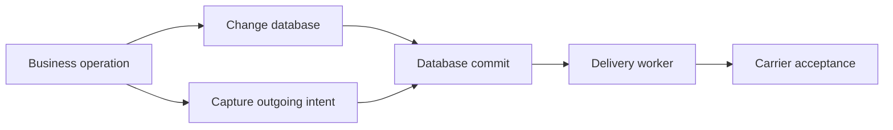

# Transactions and the outbox

An outbox addresses a dual-write problem: a business database update and a message send cannot normally commit atomically. If the database commits and the send fails, downstream work is missing. If the send succeeds and the database rolls back, downstream work describes a change that never happened.

A transactional outbox stores an outgoing intent in the same transaction as the business change. A separate worker later sends the committed intent. This changes the atomic boundary from “database plus broker” to “business rows plus outgoing rows.”

## Capture, commit and delivery

The EF reliable scoped context stages serialized `DurableSendRecord` entries and retains their admission metadata. Capacity reservation and persistence accompany the selected transaction. A committed intent is available for delivery; an uncommitted captured operation is not a completed carrier send.

The integration depends on using the correct scoped endpoints/context. A root bus reference that bypasses the transactional scope can send outside its atomic boundary. Scope creation alone is not transaction creation.

The receive integration can commit consumed inbox state, business changes and outgoing intents together. In a producer-side application operation, the application must understand the selected transaction owner and the configured commit protocol. Aborting pending outgoing capture does not, by itself, roll back arbitrary business changes on another owner.

## Delivery can duplicate

The delivery worker cannot always atomically combine carrier acceptance with its database success record. If acceptance succeeds but the database update fails, it may replay the intent.

The outbox therefore guarantees retained outgoing work according to its store contract, not exactly-once remote effects. Pair it with an [inbox](inbox-and-idempotency.md) or business idempotency where consumers must tolerate replay.

## Three mechanisms with different promises

A volatile outbox buffers outgoing operations during local processing and releases them after successful processing. Failed attempts discard their pending outgoing operations. It reduces messages leaking from a failed attempt, but neither pending operations nor their release survive process loss as a durable transactional record.

A buffered bus retains operations until an explicit flush. It has bounded local capacity and preserves unattempted work when a flush fails. Disposing a scope is not a substitute for flushing. Use it when explicit local buffering is the intended behavior.

An ambient transaction bus delays operations through volatile transaction enlistment. That does not enlist a broker as a durable resource or establish a durable atomic commit between the business database and carrier.

Choose the mechanism by its state owner and failure boundary rather than by the shared word “outbox.”

## Two public EF models currently remain

The unified path uses `UseReliableMessaging` and a selected EF reliable store, with explicit dispatcher completion semantics. A separate public EF transactional path still uses `InboxState`, `OutboxState` and `OutboxMessage` with its own settings and operational interface.

They feed the same delivery coordinator but do not share one record/guarantee model. This is [SB-ARCH-01](../reference/implementation-gaps.md). Do not mix guidance from those configurations or call the separate path private historical code. Its support and migration disposition needs an architectural decision.

## Design the business transaction

Identify the actual database effects, their DbContext, the outgoing operations and the inbox record if receiving. Keep remote HTTP effects outside the claimed database atomicity. Use stable bus identity and contract identities for persisted content, then deploy the required schema before enabling workers.

A realistic verification fails immediately before commit and after commit but before receive acknowledgment. It also interrupts carrier delivery after acceptance. These expose lost work and duplicated work at different points.

## Source grounding

<!-- openwiki: broken internal link [../../src/Persistence/ViciOne.ServiceBus.EntityFrameworkCore/Outbox] file "../../src/Persistence/ViciOne.ServiceBus.EntityFrameworkCore/Outbox" does not exist. Fix the href or restore the target, then delete this comment. -->
The [EF outbox implementation](../../src/Persistence/ViciOne.ServiceBus.EntityFrameworkCore/Outbox) defines capture and transaction integration. The [reliability contract](../../docs/reliability.md) describes unified configuration; [implementation gaps](../reference/implementation-gaps.md) records deviations.
