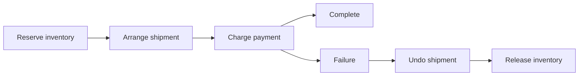

# Courier activities and compensation

Courier coordinates a distributed itinerary: execute activity A, then B, then C, carrying arguments, variables and execution history in a routing slip. If a later step fails, completed activities can be compensated in reverse order. This is a business recovery protocol rather than a transaction spanning every service.

## State travels with the routing slip

A routing slip identifies the workflow with a tracking number and contains an itinerary of activity destinations and arguments. Successful compensatable activities append logs containing the data needed for their compensation.

The routing slip itself carries progression and history. Each activity host receives it through the normal messaging runtime and executes the current itinerary entry. This differs from a [saga](sagas.md), whose durable conversation state is loaded from a repository for each event. It also differs from a [future](futures.md), which retains a requestable outcome.

Activities can revise the remaining itinerary or terminate the slip according to their result. Variables allow later arguments to use earlier results. Subscriptions receive selected routing-slip events; they are observers of progression, not the execution owner.

## Execution and compensation

This is a schematic business example. Each activity must define its own contract, arguments, effects and compensation data.

An execution activity returns an explicit result. The host evaluates that result to advance, revise, terminate or fault the slip. If the execution pipeline returns without recording a result, the host creates a faulted result; merely completing the method does not establish successful progression.

A compensation activity receives the log from a previously successful execution. Compensation processes completed compensatable work in reverse order. An activity without compensation cannot be automatically undone by this protocol.

## Compensation can fail

Returning compensation success means the activity completed its defined countereffect. It does not restore every external system to a historical snapshot. Refunding a payment is a new financial operation, for example, and may have constraints that the original charge did not have.

If compensation fails, the slip reports a compensation failure. Operational handling must decide whether to retry, reconcile or request intervention. A retryable exception and an explicitly failed result have different pipeline implications, so implement and test both execution and compensation contracts intentionally.

## Retries and outgoing effects

An activity is still a message-processing operation. Carrier redelivery and middleware retry can execute it again. Make execution and compensation idempotent with stable identifiers for their business effects.

An outbox can keep routing-slip progression from leaking out of a failed local attempt. It cannot atomically roll back an external shipment booking or payment. The integration tests for Courier outbox journeys exercise attempt discard, revised itineraries and compensation retry, illustrating why the boundary matters.

Cancellation associated with shutdown is also distinct from an activity reporting a business failure. The hosts preserve cancellation semantics rather than automatically treating every cancellation exception as successful workflow compensation.

## When Courier fits

Use Courier when the itinerary is naturally expressed as independently deployed activities and the business can define compensations. Use a saga when event correlation and persistent conversation state are central. Use a future when callers need a durable result abstraction over requests or routing slips.

Before deployment, list every execution destination, compensation destination, argument and retained log. Apply payload limits to the routing slip as history grows, and consider what information is safe to expose in subscriptions.

## Source grounding

The [execution host](../../src/ViciOne.ServiceBus.Courier/Courier/ExecuteActivityHost.cs), [compensation host](../../src/ViciOne.ServiceBus.Courier/Courier/CompensateActivityHost.cs), and [routing-slip builder](../../src/ViciOne.ServiceBus.Courier/Courier/RoutingSlipBuilder.cs) establish progression and result ownership.
