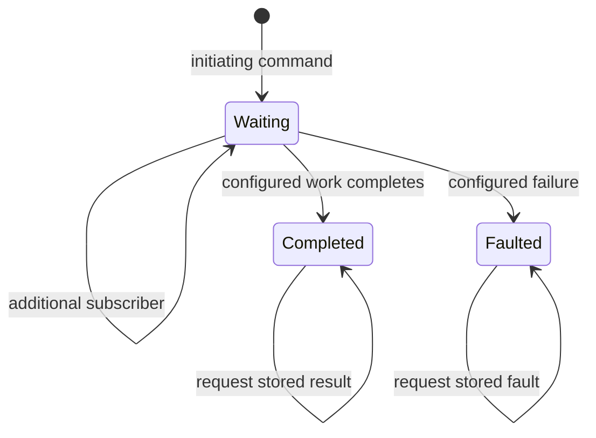

# Futures: durable asynchronous results

A future represents an asynchronous command whose terminal result remains available after the initiating request has stopped waiting. It coordinates requests, routing slips or other configured work and stores the result or fault in saga state.

This is different from a .NET `Task`. A task belongs to a running process and caller. A ServiceBus future belongs to a correlated conversation and its repository. Its durability therefore depends on the selected repository and the messaging boundaries used for its outgoing work.

## Lifecycle and identity

The command correlation identifies the future. Receiving a repeated command while waiting adds a subscriber to the same conversation instead of necessarily starting another independent workflow. A result request also subscribes while work is pending.

In completed or faulted state, later commands and result requests receive the retained outcome. A result request for a missing instance throws a future-not-found error; it is not automatically equivalent to initiating the command.

The configured correlation is thus part of the public business protocol. Two callers using different identifiers can create distinct futures even if their payloads happen to describe the same business action.

## How work is coordinated

A future derives from the saga state-machine infrastructure. Its configuration declares initiating behavior, requests, routing-slip execution, accepted responses and terminal result mapping. Pending operations and received values contribute to the retained state.

For example, a quotation future can request inventory availability and delivery pricing, wait for their results, then produce a quotation. The example is schematic: its contracts, correlation and result mapping belong to the application.

Requests inside the future are messages, not synchronous calls held on a stack until all services respond. Each response returns as an event that can update the correlated state. A routing slip can supply a multi-activity operation while the future supplies the caller-facing result lifecycle.

## Failure boundaries

The future's persisted state and outgoing operations still need an explicit persistence strategy. Storing a new state before sending a request can lose downstream work if sending fails; sending before the state commits can produce responses for an uncommitted transition. [Transactions and outbox](../reliability/transactions-and-outbox.md) explains that boundary.

A stored result does not imply every external side effect occurred exactly once. Downstream consumers and activities need their own duplicate-safe effects. A request timeout at the original caller does not erase the future; another caller can query the same correlation later.

Terminal outcome retention also belongs to future state lifecycle, not automatically to reliable inbox retention or the diagnostic journal. Decide how long outcomes remain queryable and what a missing instance means to API clients after cleanup.

## Registration and repository selection

The Futures package builds on Core, Sagas and Courier. Register the future/state machine, its repository and the required request/activity endpoints. A request-consumer future adapter can expose configured future behavior through a consumer-facing command/result interaction; it does not replace repository configuration.

InMemory repositories are useful for local demonstrations but lose state with the process. A persistent provider must support the selected saga concurrency behavior and deploy the relevant schema. Consult [persistence](../integrations/persistence-and-message-data.md) for those independent decisions.

Use [sagas](sagas.md) to understand correlation and transitions, [Courier](courier.md) to understand activity results, and [requests](../messaging/request-and-response.md) to understand the caller's waiting boundary.

## Source grounding

The [future base implementation](../../src/ViciOne.ServiceBus.Futures/Futures/Future.cs) defines waiting, subscriptions and retained terminal responses. [Future state](../../src/ViciOne.ServiceBus.Futures/Futures/FutureState.cs) owns the persisted conversation data.
