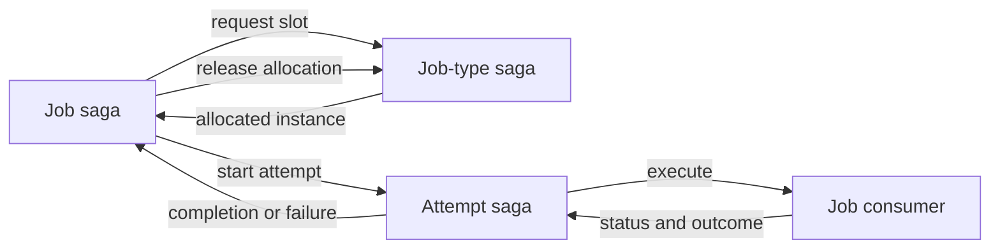

# JobService: execution and capacity coordination

JobService coordinates work that can run much longer than an ordinary consumer interaction. It allocates capacity, assigns execution attempts, supervises liveness and handles retry or cancellation. The job consumer performs the actual business work; the coordinator tracks its lifecycle.

A job is not just a delayed message or a queue with a small concurrency limit. Its identity, execution attempt and capacity allocation are distinct pieces of state.

## Three cooperating saga models

| Model | Owns |
|---|---|
| Job | Overall command, lifecycle, current attempt, completion, retry and cancellation |
| Job attempt | One assigned execution attempt and its supervision |
| Job type | Capacity allocations and participating execution instances for one job type |

The job starts by requesting a slot. The job-type coordinator considers global and per-instance capacity and chooses an available instance. The attempt coordinator supervises the assigned execution. Completion or failure returns to the overall job, and the slot is released through coordination messages.

These are separate correlated conversations. Delayed or repeated coordination messages must be matched to the correct job and attempt. A stale attempt outcome must not overwrite the state of a later attempt.

## Capacity and liveness

Endpoint concurrency bounds receive processing; job allocation bounds long-running business execution. They are related operational resources but do not express the same limit.

Job-type state tracks participating instances and allocations. Heartbeats and distribution decisions support availability and assignment. Capacity overrides and their expiration can change where later work is assigned; they do not magically migrate an already running external operation.

The attempt saga schedules status checks and can move through checking or suspect states before deciding failure. An unresponsive instance creates uncertainty: the business operation might still be running. Retrying elsewhere therefore requires idempotency or resumable work, especially for external effects.

## Retry and cancellation

The overall job schedules slot-wait and retry-delay events when coordination cannot progress immediately. The attempt has its own supervision token. Scheduling capability and stable correlation are dependencies of the protocol, rather than optional convenience settings.

Cancellation is a conversation with the assigned execution, not a guarantee that every external effect is undone instantly. The consumer should observe cancellation cooperatively and define whether partial work is retained, reversed or resumed later. Completion and cancellation can race; interpret the coordinator's terminal state rather than the initial cancellation request alone.

## Progress, checkpoints and persistence

A consumer can report progress or save a checkpoint to support long operations. Local progress buffers are not equivalent to persisted coordinator state. A checkpoint only enables resumption if the application defines how to validate and continue from it.

For an export job, a checkpoint could identify the last committed chunk. Repeated execution must use stable chunk identity so a retry does not create duplicate output. The framework coordinates attempts; it does not infer that business protocol.

Persist the three saga models through an appropriate repository when jobs must survive process loss. Deploy their schema and configure concurrency consistently across replicas. An InMemory demonstration cannot establish restart recovery.

## Choosing the workflow

Use JobService for capacity-controlled long execution. Use a saga for a broader business conversation, a future for a retained result interface, and Courier for an itinerary with compensation. They can cooperate, but each introduces a state owner that must be operated.

## Source grounding

The [job saga](../../src/ViciOne.ServiceBus.JobService/JobService/JobSaga.cs), [attempt saga](../../src/ViciOne.ServiceBus.JobService/JobService/JobAttemptSaga.cs), and [job-type saga](../../src/ViciOne.ServiceBus.JobService/JobService/JobTypeSaga.cs) define distinct state ownership.
