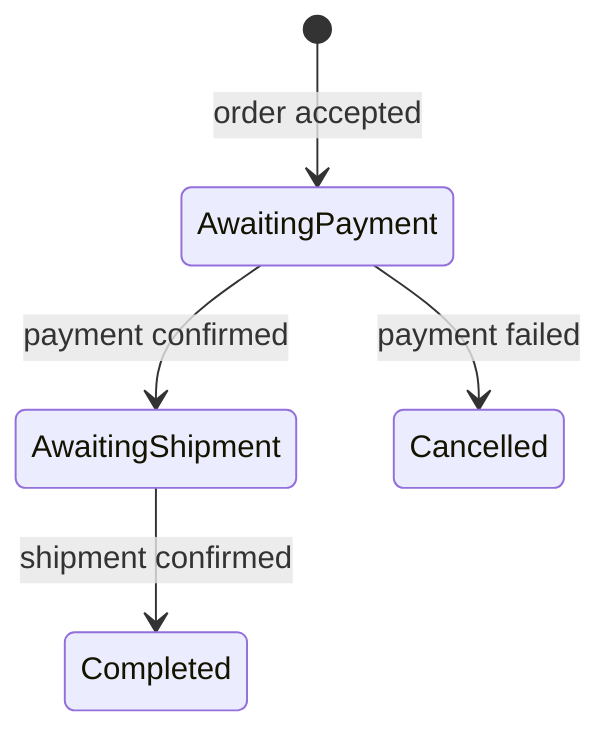

# Sagas and state machines

A saga remembers a conversation across several messages. A normal consumer handles one delivery; a saga loads the state associated with a correlation, applies an event, and stores the resulting state for later messages.

A state machine gives that conversation explicit states, events and behaviors. It does not make the entire conversation one long database transaction. Each delivery has its own repository and processing boundary.

## Correlation is the address of conversation state

An event must identify the saga instance it concerns. Correlation by ID supplies an exact key; correlation by a property can require a repository query. These are different repository capabilities.

For an order workflow, the initiating event may create a saga with the order's stable identifier. Later payment and shipment events use that same identifier. If an event supplies a new ID or an ambiguous property, the framework cannot infer that it belongs to an existing order.

Not every event is allowed to initiate a missing instance. Configure missing-instance behavior explicitly: ignore an obsolete notification, reject an invalid request, or create state when the business protocol allows it. The state-machine default for an unhandled event is an exception, so a missing transition is observable rather than automatically successful.

## States describe business knowledge

This is a schematic business model, not a complete machine declaration. Its meaning is what the service currently knows about the conversation.

State-machine behavior can change state, update instance data, publish an event, send a command or schedule a timeout. Those effects still travel through the ordinary messaging runtime. Their order and transaction integration matter if the process fails during a transition.

Initial and final state have framework meaning; the application determines how finalization affects stored instance lifecycle. A terminal business state can also be retained when later queries or events still need it.

## Repository concurrency

The repository owns loading and saving instances and the concurrency strategy. InMemory serializes ownership of local instances but loses them on process loss. EF can use its configured transaction and lock strategy; optimistic concurrency instead detects conflicting updates and requires appropriate retry.

Two replicas can receive events for the same instance simultaneously. Endpoint concurrency or a local partitioner alone does not solve cross-process repository ownership. The repository must enforce the selected concurrency contract.

Load-by-ID and property-query support are also separate. Some providers support direct identity lookup but reject arbitrary property queries. Choose correlation that the selected provider can implement; do not assume every saga repository is a general query engine.

## Timeouts and requests

A saga request can send a command and schedule a timeout event associated with its request ID. The later response or timeout becomes another event. The saga is not holding a caller's in-process request task open across the whole conversation.

For positive request timeouts, the implementation validates scheduler cancellation capability before sending the request. It needs the required token ownership semantics to avoid a schedule that cannot be safely cancelled or replaced. See [scheduling](scheduling.md): native provider-assigned tokens and caller-specified tokens are not interchangeable.

A late response can arrive after timeout or completion. Define how the state machine handles it. Removing a scheduled timeout does not erase a response already in flight.

## Atomicity and external effects

Repository commit records the transition. Outgoing commands/events need an outbox if they must be captured atomically with that state change under the chosen provider integration. Registering a saga repository alone does not prove that integration.

External calls still require idempotency and reconciliation. A saga records business progress and uncertainty; it does not automatically reverse a charge or shipment. [Courier](courier.md) supplies an explicit compensation itinerary when that is the appropriate business model.

## Source grounding

<!-- openwiki: broken internal link [../../src/ViciOne.ServiceBus.Sagas/SagaStateMachine] file "../../src/ViciOne.ServiceBus.Sagas/SagaStateMachine" does not exist. Fix the href or restore the target, then delete this comment. -->
The [saga repository](../../src/ViciOne.ServiceBus.Sagas/Saga/SagaRepository.cs), [state-machine infrastructure](../../src/ViciOne.ServiceBus.Sagas/SagaStateMachine), and [request activity](../../src/ViciOne.ServiceBus.Sagas/SagaStateMachine/Activities/RequestActivityImpl.cs) define correlation, transitions and timeout prerequisites.
